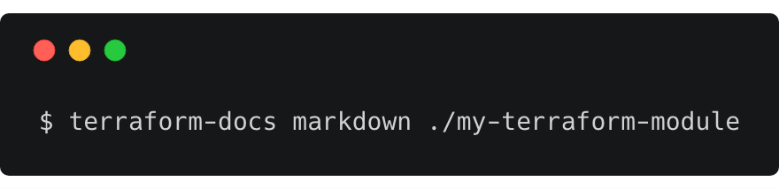

# terraform-docs

[](https://github.com/terraform-docs/terraform-docs/actions) [](https://pkg.go.dev/github.com/terraform-docs/terraform-docs) [](https://goreportcard.com/report/github.com/terraform-docs/terraform-docs) [](https://codecov.io/gh/terraform-docs/terraform-docs) [](https://github.com/terraform-docs/terraform-docs/blob/master/LICENSE) [](https://github.com/terraform-docs/terraform-docs/releases)



## What is terraform-docs

A utility to generate documentation from Terraform modules in various output formats.

## Documentation

- **Users**
  - Read the [User Guide] to learn how to use terraform-docs
  - Read the [Formats Guide] to learn about different output formats of terraform-docs
  - Refer to [Config File Reference] for all the available configuration options
- **Developers**
  - Read [Contributing Guide] before submitting a pull request

Visit [our website] for all documentation.

## Installation

The latest version can be installed using `go get`:

```bash
GO111MODULE="on" go get github.com/terraform-docs/terraform-docs@v0.14.1
```

**NOTE:** to download any version **before** `v0.9.1` (inclusive) you need to use to
old module namespace (`segmentio`):

```bash
# only for v0.9.1 and before
GO111MODULE="on" go get github.com/segmentio/terraform-docs@v0.9.1
```

**NOTE:** please use the latest Go to do this, minimum `go1.16` or greater.

This will put `terraform-docs` in `$(go env GOPATH)/bin`. If you encounter the error
`terraform-docs: command not found` after installation then you may need to either add
that directory to your `$PATH` as shown [here] or do a manual installation by cloning
the repo and run `make build` from the repository which will put `terraform-docs` in:

```bash
$(go env GOPATH)/src/github.com/terraform-docs/terraform-docs/bin/$(uname | tr '[:upper:]' '[:lower:]')-amd64/terraform-docs
```

Stable binaries are also available on the [releases] page. To install, download the
binary for your platform from "Assets" and place this into your `$PATH`:

```bash
curl -Lo ./terraform-docs.tar.gz https://github.com/terraform-docs/terraform-docs/releases/download/v0.14.1/terraform-docs-v0.14.1-$(uname)-amd64.tar.gz
tar -xzf terraform-docs.tar.gz
chmod +x terraform-docs
mv terraform-docs /some-dir-in-your-PATH/terraform-docs
```

**NOTE:** Windows releases are in `ZIP` format.

If you are a Mac OS X user, you can use [Homebrew]:

```bash
brew install terraform-docs
```

or

```bash
brew install terraform-docs/tap/terraform-docs
```

Windows users can install using [Scoop]:

```bash
scoop bucket add terraform-docs https://github.com/terraform-docs/scoop-bucket
scoop install terraform-docs
```

or [Chocolatey]:

```bash
choco install terraform-docs
```

Alternatively you also can run `terraform-docs` as a container:

```bash
docker run quay.io/terraform-docs/terraform-docs:0.14.1
```

**NOTE:** Docker tag `latest` refers to _latest_ stable released version and `edge`
refers to HEAD of `master` at any given point in time.

## Community

- Discuss terraform-docs on [Slack]

## License

MIT License - Copyright (c) 2021 The terraform-docs Authors.

[User Guide]: ./docs/user-guide/introduction.md
[Formats Guide]: ./docs/reference/terraform-docs.md
[Config File Reference]: ./docs/user-guide/configuration.md
[Contributing Guide]: CONTRIBUTING.md
[our website]: https://terraform-docs.io/
[here]: https://golang.org/doc/code.html#GOPATH
[releases]: https://github.com/terraform-docs/terraform-docs/releases
[Homebrew]: https://brew.sh
[Scoop]: https://scoop.sh/
[Chocolatey]: https://www.chocolatey.org
[Slack]: https://slack.terraform-docs.io/
